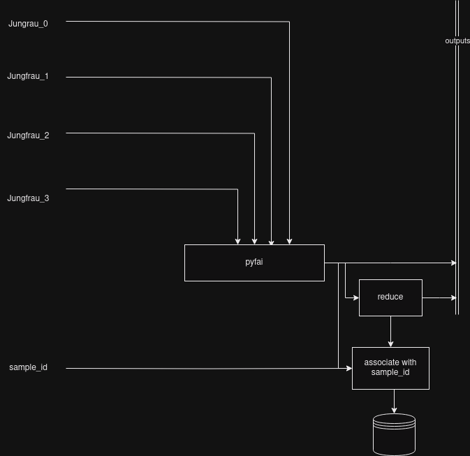

# hed-context-files

Here I attempt to encapsulate the processing requirements for the total scattering experiments by illustrating them with graphs and [context files](https://rtd.xfel.eu/docs/metropc/en/preview/context.html).

## Background / Substrate data collections
The _simplest_ data collections we'll want to perform. We need to subtract the scattering from the substrate when we're looking at a sample, so we begin by collecting a blank substrate. This is that data collection.

