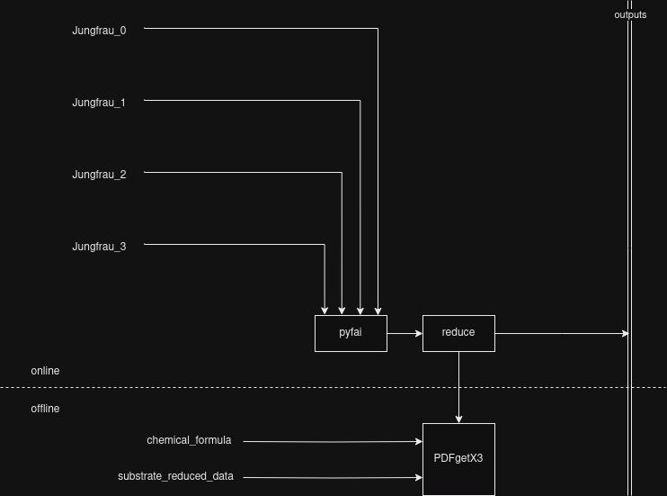

# hed-context-files

Here I attempt to encapsulate the processing requirements for the total scattering experiments by illustrating them with graphs and, eventually, [context files](https://rtd.xfel.eu/docs/metropc/en/preview/context.html).

## Background / Substrate data collections
The _simplest_ data collections we'll want to perform. We need to subtract the scattering from the substrate when we're looking at a sample, so we begin by collecting a blank substrate. This is that data collection.

## Sample data collections
The less simple data collection, in which we need to find out what sample this is and what background to use

## other things to consider
- running a pyfai calibration, particularly for detectors at high Q
- is it in efficient to have Views performing a `requests.get(f"{databaseuri}/substrate/{sample_id})` or similar?
- where the db will be hosted
- do we just hard-code the pyfai poni file?
- pyfai would be much more efficient if the integrator hangs around...
- reducing / averaging / summing
